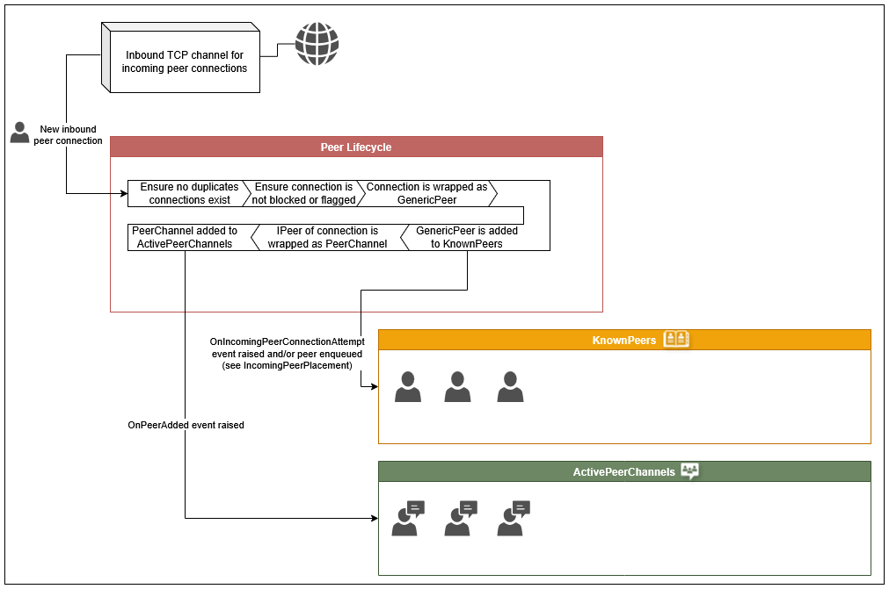

### Peers

---

Peers are representative of client users within the peer network. When a connection is established to a peer through the TCP listener, the connection by default is wrapped in an instance of the `GenericPeer` implementation of `IPeer` and the `PeerChannel` which stores an `IPeer` implementation.

The `IPeer` interface defines the essential properties and methods for a peer, including the IP address, port, TCP client, network stream, and a unique identifier. The `GenericPeer` class provides a default implementation of the `IPeer` interface, encapsulating the peer's IP address, port, TCP client, and network stream. It also includes a unique identifier for the peer, which can be used for whitelisting and blacklisting peers in the network.

The `PeerChannel` class represents a communication channel with a peer in the P2P network. It manages the sending and receiving of data packets, handles connection retries, and maintains the state of the communication channel. The `PeerChannel` class also includes methods for opening and closing the channel, as well as handling incoming and outgoing data packets. The `PacketHandleProtocol` class stores the Action delegates for each packet type, and the `PeerChannel` will invoke these by default depending on the respective data packet type.

##### Peer Lifecycle

---

The lifecycle of a peer in the P2P network begins with the discovery and connection phase. When a new peer is discovered, the handler checks if the peer is already known or queued. If the peer is new, it is wrapped in an instance of the `GenericPeer` class and, depending on the `IncomingPeerTrustPolicy.IncomingPeerTrustPolicy` value, will be either enqueued and/or passed in the event `OnIncomingPeerConnectionAttempt` and finally will be added to the `KnownPeers` list.

Once the connection is established, a `PeerChannel` is created to manage the communication with the peer. The `PeerChannel` handles the sending and receiving of data packets, connection retries, and maintains the state of the communication channel. The `PeerChannel` will then be added to the `ActivePeerChannels` list. The `PeerChannel` also invokes the appropriate Action delegates from the `PacketHandleProtocol` class based on the type of data packet received. This ensures that the correct actions are taken for each type of data packet, facilitating efficient and reliable communication between peers.

There are some trust policies under `IncomingPeerTrustPolicy` that can slighly modify the initial behavior of the established `PeerChannel`

1. `AllowDefaultCommunication` - as the name implies, allows default communication between peers to exchange `PureMessagePackets`. Default is **true**.
2. `AllowEnhancedPacketExchange` - determines if peers will be trusted to exchange all other packet types, such as `DataTransmissionPackets`, which contain binary data such as files and network-related tasks. Default is **false**.

